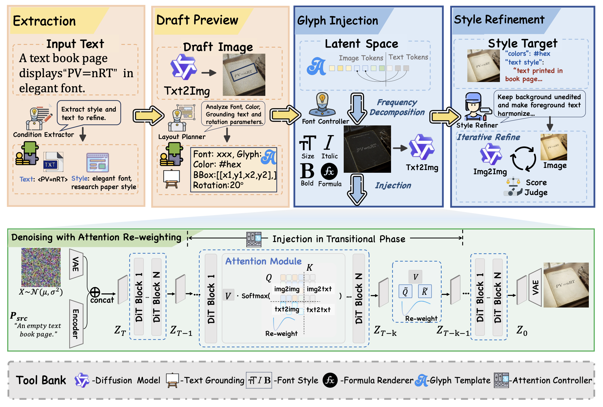
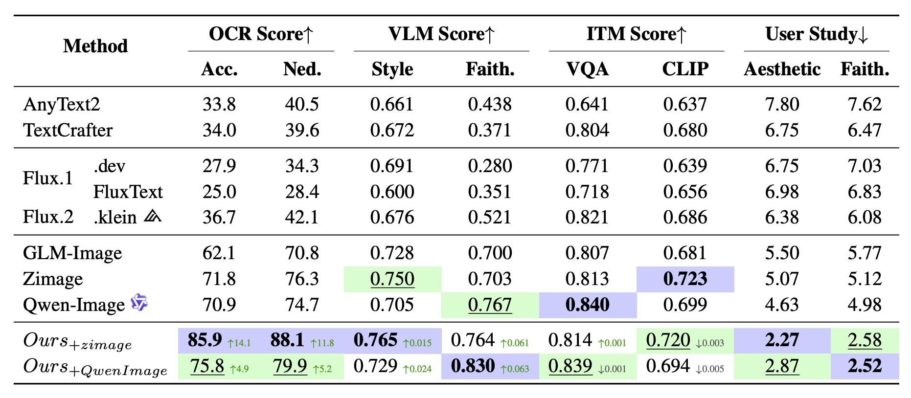

# GlyphBanana: Text Rendering with Glyph Injection

[](https://arxiv.org/abs/2603.12155)
[](LICENSE)

GlyphBanana is a text-to-image generation framework designed for high-quality text rendering in images. It uses an agentic workflow with VLM-guided typography planning and glyph injection for precise text placement.

## Overview



GlyphBanana employs a **four-stage agentic pipeline** to achieve precise text rendering:

1. **Condition Extraction**: Analyzes the input prompt to extract text content and style requirements
2. **Layout Planning**: Uses VLM to analyze draft images and generate typography plans (font, color, bounding box, rotation)
3. **Glyph Injection**: Renders precise glyph shapes and injects them into latent space during the transitional denoising phase, with attention re-weighting to strengthen text-to-image associations
4. **Style Refinement**: Optional harmonization to blend text naturally with the background while preserving legibility

### Key Advantages

- **Plug-and-Play Design**: Works with any diffusion model without fine-tuning
- **Precise Control**: Direct glyph injection ensures character-level accuracy
- **Flexible Layout**: VLM-guided planning supports arbitrary text positioning and styling
- **Attention Enhancement**: Re-weighting mechanism strengthens text-region focus during generation

## Benchmark Results



Our method achieves **state-of-the-art performance** on text rendering benchmarks. GlyphBanana significantly outperforms existing approaches:

- **OCR Accuracy**: 85.9% (vs. 71.8% for Zimage baseline, +14.1)
- **OCR Normalized Edit Distance**: 88.1 (vs. 76.3 for Zimage baseline, +11.8)
- **VLM Faithfulness**: 0.764 (vs. 0.703 for Zimage baseline)
- **User Study Rankings**: Best aesthetic quality (2.27) and faithfulness (2.58)

The results demonstrate GlyphBanana's superior capability in generating readable, well-integrated text across diverse scenarios.

## Installation

```bash
git clone <repo-url>
cd GlyphBanana
pip install -r requirements.txt

export QST_BASE_URL="your-api-url"
export QST_API_KEY="your-api-key"
```

## Quick Start

### Generation

```bash
python generate.py \
    --prompt 'A whiteboard displaying "E=mc²" in a classroom' \
    --text "E=mc²" \
    --output output.png
```

### Evaluation

```bash
python evaluate.py \
    --image_dir outputs/ \
    --prompt_file prompts.json \
    --output results.json
```

## Usage

### Generation Options

```bash
python generate.py \
    --backend zimage \
    --prompt "Your prompt with text description" \
    --text "Text to render" \
    --output result.png \
    --steps 20 \
    --seed 42 \
    --height 1024 \
    --width 1024
```

Custom layout can be passed via `--text-regions-file regions.json`:

```json
[
  {
    "content": "GlyphBanana",
    "bbox": [0.1, 0.35, 0.9, 0.55],
    "font": "auto",
    "color": "#FFFFFF"
  }
]
```

### Evaluation Options

```bash
python evaluate.py \
    --image_dir results/ \
    --prompt_file data.json \
    --vlm_model qwen3-vl-235b-a22b-instruct \
    --output scores.json
```

The `prompts.json` file should map image filenames to their expected text:

```json
{
  "image1.png": "A sign saying \"Hello World\"",
  "image2.png": "A poster with \"Sale 50% Off\""
}
```

## Project Structure

```
GlyphBanana/
├── generate.py          # Unified generation entry for zimage/qwen-image
├── evaluate.py          # OCR evaluation script + reusable helpers
├── demo/                # Gradio demo
├── scripts/             # Batch generation/evaluation scripts
├── requirements.txt     # Dependencies
├── infer/               # Core inference modules
│   ├── VLM_agent.py         # VLM API interface
│   ├── glyph_injector.py    # Glyph rendering and latent injection
│   ├── qwen_image_inference.py # Qwen-image backend
│   ├── formula_helper.py    # Text/LaTeX rendering
│   └── attn_enhancement.py  # Attention enhancement
├── train/zimage_ip/     # ZImage pipeline (core generation model)
├── baselines/           # Minimal baselines
└── eval/                # Evaluation module and benchmark datasets
```

## Model Requirements

- **Base Model**: FLUX.1-Fill-dev or compatible
- **VLM API**: OpenAI-compatible API for typography analysis and OCR
- **Optional**: FluxKlein for harmonization (Pass 3)

## API Configuration

Set environment variables for VLM access:

```bash
export QST_BASE_URL="https://your-api-endpoint.com/v1"
export QST_API_KEY="your-api-key"
export QST_API_KEY2="backup-api-key"  # Optional
```

## Citation

If you find this work useful, please cite:

```bibtex
@misc{glyphbanana,
      title={GlyphBanana: Advancing Precise Text Rendering Through Agentic Workflows}, 
      author={Zexuan Yan and Jiarui Jin and Yue Ma and Shijian Wang and Jiahui Hu and Wenxiang Jiao and Yuan Lu and Linfeng Zhang},
      year={2026},
      eprint={2603.12155},
      archivePrefix={arXiv},
      primaryClass={cs.CV},
      url={https://arxiv.org/abs/2603.12155}, 
}
```

## License

MIT License
